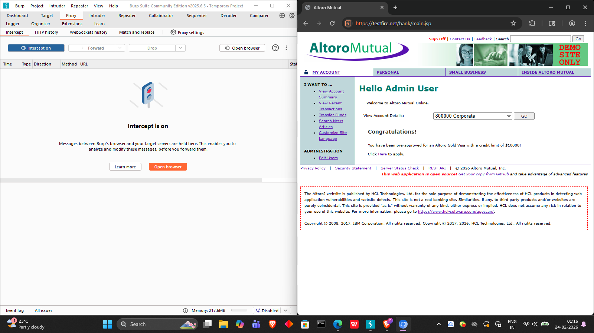
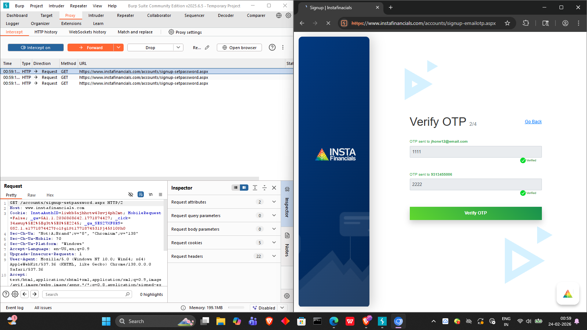

## 🔐 Web Application Vulnerability Assessment – Altoro Mutual (Burp suite Lab)

## 📌 Project Overview 

This project demonstrates a web application security assessment performed on the vulnerable banking application Altoro Mutual using Burp Suite Community Edition and standard VAPT methodology.

The objective was to identify and validate common web vulnerabilities such as:

- SQL Injection (Authentication bypass)

- Cross-Site Scripting (XSS)

- Weak Authentication / Credential Brute-Force

- OTP Verification Logic Testing

- Input Encoding & Decoding Analysis

This assessment simulates a real-world penetration testing workflow aligned with OWASP Top 10 and Nessus-based lab practice.

## 🛠️ Tools Used

- Burp Suite Community Edition

- Web Browser (Burp Proxy configured)

- Altoro Mutual Demo Application

- Encoding/Decoding utilities (Burp Decoder)

## 🎯 Target Application

Application: Altoro Mutual Online Banking
Type: Vulnerable Demo Banking Web App
Purpose: Security testing & vulnerability demonstration

## 🔎 Vulnerability Findings

## 1️⃣ SQL Injection – Authentication Bypass
## Description

The login form does not properly sanitize user input, allowing SQL injection payloads to manipulate backend queries and bypass authentication.
<p align="center">
  
</p>
<p align="center">  </p>

## Payload Used
```python
' OR 1=1--
```


## Impact

- Unauthorized access to admin account
- Full banking dashboard access
- Sensitive data exposure

## Evidence
- Login bypass successfully achieved.


## 2️⃣ Cross-Site Scripting (Reflected XSS)

## Description
The search parameter reflects unsanitized input into the response page, enabling JavaScript execution in the victim browser.
<p align="center">  </p>

## Payload
```python
<script>alert('xss attack')</script>
```

<p align="center">  </p>

## Impact

- Session hijacking risk
- Phishing attacks
- Malicious script execution


## 3️⃣ Credential Brute-Force via Burp Intruder

## Description

### Login endpoint allows unlimited authentication attempts without rate-limiting or CAPTCHA protection.
Burp Intruder was used with username/password wordlists.
<p align="center">  </p>
<p align="center">  </p>

## Attack Type :
```python
Sniper / Cluster Bomb (Burp Intruder)
```

<p align="center">  </p>

## Impact
Account compromise risk
Password guessing attacks

## 4️⃣ OTP Verification Logic Analysis

## Description
OTP verification flow intercepted and analyzed using Burp Proxy.
<p align="center">  </p>

## Observed behavior:
- OTP values predictable/testable
- Multiple OTP parameters exposed
- No strict validation logic

## Impact
- OTP bypass risk
- Account takeover possibility

## 5️⃣ Input Encoding / Hash Analysis

## Description
Burp Decoder used to analyze encoded credentials and parameters.
<p align="center">  </p>

## Example:
```python
756d616e6720706174656c
```

## Decoded to:
```python
umang patel
```


## Impact
- Sensitive data exposed via encoding
- Weak obfuscation instead of encryption

## 📊 Risk Summary
| Vulnerability | Severity | Status    |
| ------------- | -------- | --------- |
| SQL Injection | Critical | Confirmed |
| XSS           | High     | Confirmed |
| Brute-Force   | High     | Confirmed |
| OTP Logic     | Medium   | Observed  |
| Weak Encoding | Low      | Observed  |


## 🧪 Methodology

### Testing followed standard VAPT process:
1. Reconnaissance
2. Interception (Burp Proxy)
3. Parameter Analysis
4. Payload Injection
5. Intruder Attacks
6. Response Analysis
7. Vulnerability Validation

## Aligned with:
- OWASP Top 10
- Web App Pentesting Guide
- Burp suite Lab Practice

## 🛡️ Remediation Recommendations

## SQL Injection
- Use parameterized queries
- Input validation & sanitization
- ORM frameworks

## XSS
- Output encoding
- Content Security Policy (CSP)
- Input filtering

## Brute-Force
- Account lockout
- CAPTCHA
- Rate limiting

## OTP
- Server-side validation
- Expiry & single-use OTP
- Attempt limits

## Encoding
- Use encryption (AES/Hash)
- Avoid exposing sensitive data

## 📚 Learning Outcomes

### This project demonstrates practical skills in:
- Burp Suite usage
- Web vulnerability exploitation
- Authentication testing
- OWASP vulnerability identification
- Security reporting

## ⚠️ Disclaimer

This project was conducted on a deliberately vulnerable demo application (Altoro Mutual) for educational purposes only.
No real systems or user data were harmed.

## 👨‍💻 Author

## UMANG PATEL
## Cybersecurity / VAPT Learner
